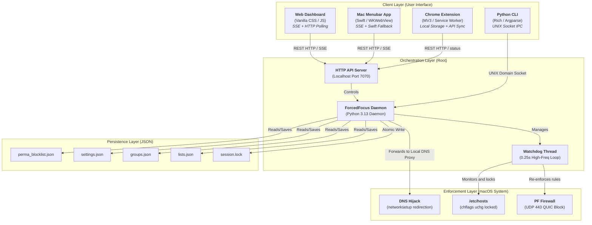

<!-- prettier-ignore -->
<div align="center">

# ForcedFocus

[](https://www.apple.com/macos)
[](https://www.python.org/)
[](https://developer.apple.com/swift/)
[]

[Overview](#project-name-and-description) • [Technology Stack](#technology-stack) • [Architecture](#project-architecture) • [Getting Started](#getting-started) • [Features](#key-features) • [Testing](#testing)

</div>

## Project Name and Description

**ForcedFocus** is a multi-layered, root-level productivity enforcement utility for macOS. It establishes a high-integrity, un-bypassable deep work environment using defense-in-depth operating system restrictions. 

Unlike standard website blockers that are trivial to bypass, ForcedFocus enforces focus commitments through cryptographic delays, hardware-level network locks, DNS redirection, and kernel/filesystem-level safeguards.

> [!IMPORTANT]
> Stopping an active session prematurely requires entering your security key, which enforces an unavoidable 20-minute cooldown delay before unlocking.

## Technology Stack

ForcedFocus is built across multiple layers using a robust technology stack:

- **Orchestration Layer**: Python 3.13 (Daemon running as root)
- **Client Layer**:
  - **Web Dashboard**: Vanilla HTML5, ES6 JavaScript, and Vanilla CSS (served via Python HTTP API)
  - **macOS Menubar App**: Swift / WKWebView
  - **Chrome Extension**: Manifest V3 / Service Worker
  - **CLI Utility**: Python with `Rich` and `Argparse`
- **Enforcement Layer**:
  - PF Firewall Rules (`pfctl`)
  - Local DNS Interceptor (`127.0.0.1:53`)
  - Immutable Configuration Flags (`chflags uchg`)
- **Persistence Layer**: Local JSON schemas

## Project Architecture

The system operates across four primary layers: Client, Orchestration, Enforcement, and Persistence.



## Getting Started

### Prerequisites

- **Operating System**: macOS (requires `pfctl` support and `launchd`).
- **Runtime**: Python 3.13 or newer.
- **Privileges**: Root privileges (`sudo`) are required to install and start the daemon.

### Installation

Clone the repository and run the installer script as root:

```bash
sudo bash install.sh
```

> [!NOTE]
> During installation, you will be prompted to enter a Security Key passphrase (hashed securely via PBKDF2). Keep this safe, as it is required to stop sessions or uninstall the application.

### Uninstallation

To remove the LaunchDaemon, binary paths, configs, and restore your `/etc/hosts` file, run the uninstaller:

```bash
sudo bash uninstall.sh
```

> [!WARNING]
> Uninstallation requires your Security Key passphrase. If you have active Permanent Block entries, the uninstaller will preserve them in `/etc/hosts` and maintain the system-level file lock (`chflags uchg`) to prevent tampering.

## Project Structure

- `cli/`: Python CLI tool (`forcefocus`).
- `daemon/`: Python 3.13 Orchestration Daemon and API server.
- `docs/`: Master specification and design documentation.
- `web/`: The frontend Web Dashboard (HTML/CSS/JS).
- `menubar/`: Swift-based macOS Menubar application.
- `chrome-extension/`: MV3 Chrome browser extension.
- `scripts/`: Utility and testing scripts.
- `install.sh` / `uninstall.sh`: Core setup scripts.

## Key Features

- **High-Integrity Session Locking**: Start focus sessions with cryptographic passphrases. 
- **Defense-in-Depth Network Blocking**:
  - **PF Firewall Rules**: Blocks UDP port 443 (QUIC/HTTP3 protocol bypasses) at the packet level.
  - **DNS Hijacking**: Redirects queries to a local loopback listener.
  - **Immutable `/etc/hosts`**: Modifies host files and locks them with system-level immutable flags.
- **Pomodoro Engine**: Fully customizable Pomodoro sessions (cycles, focus/break periods, automated transitions) with audible cues.
- **Tactical Dark Mode UI**: An aesthetic, geometric, and developer-focused interface.
- **Permanent Block**: A specialized mechanism to permanently block sites with a mandatory 30-minute unblock delay that survives system reboots and app uninstallation attempts.

## Development Workflow

1. Modify components in their respective directories (e.g., `web/`, `daemon/`, `menubar/`).
2. Run browser smoke checks to cover idle, active standard, Pomodoro focus/break, recurring schedule edit, rules edit, and settings save.
3. Validate API interactions via the local server on port `7070`.
4. Ensure `node --check web/app.js` and `node --check web/settings.js` pass.
5. Run the testing commands before sharing changes.

## Coding Standards

- **Typography**: Display uses `JetBrains Mono` or standard system monospaced sans. Telemetry uses tabular-nums. Body uses `Inter` or `-apple-system`.
- **UI Design**: Tactical Dark Mode aesthetic with strict geometric cards (`6px` border radius), explicit borders, and prominent use of Obsidian (`#09090B`), Carbon (`#18181B`), and Accent Indigo (`#4F46E5`) colors.

## Testing

ForcedFocus is tested thoroughly using a combination of automated tests and manual smoke checks:

- **Automated Python Tests**: Run the pytest suite from the repository root:
  ```bash
  python3 -m pytest
  ```
- **Manual QA Requirements**: Verify that active focus never applies `.disabled` to `modeCard`, `sessionSettingsCard`, `scheduleCard`, or `rescueCard`.

## Contributing

We welcome contributions from the community. When making changes:
- Keep the UI focused on the "Calm command center" principle without decorative noise.
- Ensure that active-focus usability allows users to manage rules and schedules while focusing.
- Verify that your changes do not introduce bypass vectors to the Enforcement Layer.
- Ensure all tests pass prior to submitting changes.

## License

ForcedFocus is distributed under the MIT License. See the `LICENSE` file for more information.
